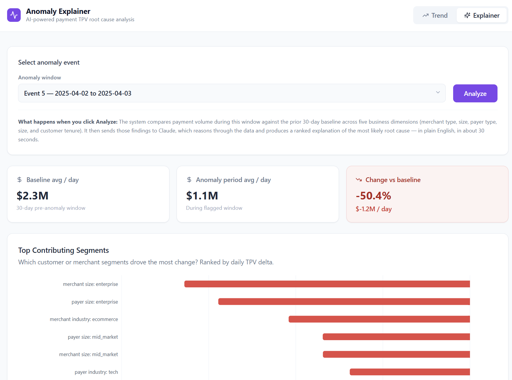

# Anomaly Explainer

Most analytics tools tell you **when** something happened. This tells you **why**.

A pipeline monitors B2B payment volume in real time. When Prophet flags a statistical anomaly, the system decomposes it across five business dimensions using custom SQL, feeds the structured findings to Claude, and streams back a ranked root cause narrative — the kind a senior analyst would spend 30–90 minutes producing manually.

**The AI work is not the alerting. It is the reasoning.**

---

## Demo



> *Select an anomaly window → click Analyze → watch decomposition data render immediately, then the root cause narrative stream in token by token.*

Two tabs:
- **Trend** — daily TPV time-series per product with annotated anomaly bands
- **Explainer** — segment contribution chart + live Claude narrative

---

## How It Works

```
Postgres (7M rows synthetic B2B payments, 2022–2026)
  │
  ▼
Anomaly Detection  [detection/prophet_model.py]
  Prophet per product on daily aggregate TPV
  US holiday calendar · weekly + yearly seasonality · linear trend
  Flag: residual z-score > 2.5σ on 30-day trailing window
  │
  ▼
Segment Decomposition  [decomposition/segment_decomposer.py]
  Anomaly window vs 30-day baseline, across all 5 dimensions:
    merchant_industry · merchant_size · payer_industry
    payer_size · payer_tenure_bucket
  + top 5 pairwise interactions (10 dimension pairs searched)
  Ranked by avg daily TPV delta; output is JSON-ready for the LLM prompt
  │
  ▼
LLM Narrative Layer  [narrative/llm_synthesizer.py]
  Claude Opus 4 (claude-opus-4-7) · adaptive thinking · prompt caching
  System prompt: schema context + interpretation guide (uniform vs concentrated delta)
  Output: TL;DR · ranked hypotheses · most diagnostic dimension · next steps
  │
  ▼
FastAPI Backend  [api/main.py]
  GET  /events      — 6 flagged anomaly windows
  GET  /timeseries  — daily TPV + anomaly bands
  POST /analyze     — Server-Sent Events: decomposition JSON first, then Claude tokens
  │
  ▼
Next.js 15 Frontend  [frontend/]
  Event + product picker · summary metric cards
  Segment contribution bar chart (Recharts, red=drop / green=spike)
  Live-streaming narrative via react-markdown
```

---

## Dataset

Synthetic — generated by `data/generate_synthetic_payments.py`. Not real data; designed to be realistic enough that a statistical model and an LLM produce interesting, non-trivial outputs.

| | |
|---|---|
| Rows | ~7.15 million |
| Date range | 2022-01-01 to 2026-05-09 |
| Products | `regular_ach` (+15% YoY), `check` (−8%), `two_day_ach` (+45%), `one_day_ach` (+70%) |
| Dimensions | 1,125 combinations across 5 axes |
| Noise model | Log-normal per product (σ = 0.14–0.20) |
| Patterns | Day-of-week peaks, monthly seasonality, US federal holidays |
| Settlement | 7-day ACH / 14-day check; `tpv_settled` ramps via cubic interpolation |

**6 seeded anomaly events** with known causes, stored in `anomaly_ground_truth`:

| # | Event | Dates | Products | Dimension |
|---|-------|-------|----------|-----------|
| 1 | SVB bank collapse | Mar 10–17 2023 | ACH ↓, check ↑ | all (systemic) |
| 2 | NACHA rail outage | Sep 15–19 2023 | ACH ×0.55 → ×1.30 | all (systemic) |
| 3 | Fraud ring | Feb 21–25 2024 | one_day_ach ↑ | ecommerce × enterprise |
| 4 | Cyber Monday surge | Nov 25–29 2024 | multi-product ↑ | merchant_industry |
| 5 | Platform outage | Apr 2–3 2025 | one_day_ach ×0.35 | all (systemic) |
| 6 | Year-end enterprise rush | Dec 22–31 2025 | ACH + check ↑ | merchant_size (enterprise) |

---

## Technical Design Choices

**Why Prophet for detection?**  
Prophet decomposes the signal into trend + weekly seasonality + yearly seasonality + holiday effects. Those interpretable components are passed to the LLM narrative layer, letting Claude reason about whether the anomaly coincides with a holiday, falls on a specific day of week, or breaks from the long-run trend. A black-box model (e.g. LSTM) would give a number, not context.

**Why custom SQL decomposition instead of a library?**  
The schema is known. Custom GROUP BY queries are transparent, debuggable, and produce a clean dict that maps directly to the LLM prompt — no intermediate transformation. The output structure was designed around what Claude needs to reason well, not around what a library returns.

**Why adaptive thinking + prompt caching?**  
Adaptive thinking lets Claude allocate extended reasoning for complex multi-hypothesis events (fraud rings, multi-product shocks) while staying fast for clear-cut ones. Prompt caching pins the static 125-line system prompt (schema + interpretation guide) across calls, cutting input token cost significantly for repeated analyses in a session.

**Why SSE instead of polling?**  
The decomposition arrives in ~2 seconds; the narrative takes 20–30 seconds to stream. SSE lets the frontend render the chart immediately while the narrative builds word by word — the user sees signal before the full response is ready. Polling would require buffering the entire narrative server-side before sending it.

**Eval anti-leakage design:**  
`anomaly_ground_truth` is never read by the detection, decomposition, or LLM layers. Only `eval/scorer.py` accesses it. This means attribution accuracy is a genuine blind test, not a metric that could silently inflate if a module were accidentally given the answers.

---

## Eval

Two-layer evaluation runs fully automated:

### Layer 1 — Detection + Attribution

```bash
python -m eval.scorer           # ~30 s (uses cached Prophet results)
python -m eval.scorer --fresh   # ~5 min (re-fits Prophet from scratch)
```

```
DETECTION  (did Prophet flag the right windows?)

  [PASS]  SVB bank collapse                          regular_ach     lag 1d  z=3.2
  [PASS]  SVB bank collapse                          check           lag 0d  z=4.1
  [PASS]  NACHA rail outage                          regular_ach     lag 0d  z=6.8
  ...

  Recall: N/M product-event pairs detected (X%)

ATTRIBUTION  (did decompose() identify the right dimension?)

  [PASS]  Fraud ring                                 one_day_ach     top=merchant_industry  gt=merchant_industry × merchant_size
  [PASS]  NACHA rail outage                          regular_ach     top=payer_tenure_bucket  gt=all  (uniform ✓)
  ...

  Attribution accuracy: N/M detected events (X%)
```

### Layer 2 — Narrative Quality (LLM-as-judge)

```bash
python -m eval.narrative_scorer           # re-judges cached narratives
python -m eval.narrative_scorer --fresh   # re-generates narratives + re-judges
```

A separate `claude-sonnet-4-6` model scores each narrative on five criteria (1–5 each) given the ground truth and the decomposition data the narrator was given:

| Criterion | What it measures |
|---|---|
| `hypothesis_accuracy` | True root cause present in ranked hypotheses (#1 = 5) |
| `evidence_specificity` | Concrete numbers cited from decomposition |
| `dimension_identification` | Correct most-diagnostic dimension named |
| `confidence_calibration` | Certainty level matches evidence (systemic = lower confidence) |
| `actionability` | Next steps name specific systems, logs, or teams |

Sonnet judges Opus rather than Opus judging itself — using the same model on an identical system prompt would bias scores toward outputs that resemble its own style.

Narratives are cached to `eval/narrative_cache.json` (~$0.20/narrative in Opus tokens). The judge always re-runs (~$0.002/call in Sonnet tokens), so rubric changes don't require re-generating narratives.

---

## Stack

| Layer | Technology |
|---|---|
| Data store | PostgreSQL 15 (Docker) |
| Detection | Prophet (Meta) |
| Decomposition | Custom SQL + pandas |
| LLM | Claude API — `claude-opus-4-7`, adaptive thinking, prompt caching |
| Backend | FastAPI + uvicorn |
| Frontend | Next.js 15, Tailwind CSS, Recharts, react-markdown |
| Eval judge | `claude-sonnet-4-6` |

---

## Setup

### Prerequisites

- Docker
- Python 3.11+
- Node.js 18+
- Anthropic API key

### Steps

```bash
# 1. Start Postgres
docker run --name transactions-db \
  -e POSTGRES_PASSWORD=olist123 \
  -e POSTGRES_DB=transactions \
  -p 5432:5432 -d postgres:15

# 2. Install Python dependencies
pip install -r requirements.txt

# 3. Generate synthetic data (~3 min, ~7M rows)
python data/generate_synthetic_payments.py

# 4. Configure API key
cp .env.example .env
# edit .env: ANTHROPIC_API_KEY=sk-ant-...

# 5. Start the backend
uvicorn api.main:app --reload --port 8000

# 6. Start the frontend (new terminal)
cd frontend && npm install && npm run dev

# 7. Open http://localhost:3000
```

**CLI alternative** (no frontend needed):
```bash
python run.py
```

**Data explorer** (Streamlit time-series dashboard):
```bash
streamlit run dashboard.py
```

**Run eval:**
```bash
python -m eval.scorer                  # detection + attribution
python -m eval.narrative_scorer        # narrative quality (requires API key)
```

---

## Project Structure

```
├── run.py                        # CLI: menu → decompose → stream narrative
├── dashboard.py                  # Streamlit time-series explorer
├── events.py                     # canonical anomaly window list
│
├── data/
│   ├── generate_synthetic_payments.py
│   └── DATA_DESCRIPTION.md
│
├── detection/
│   └── prophet_model.py          # Prophet fit, z-score flagging
│
├── decomposition/
│   └── segment_decomposer.py     # SQL: 5 dims + 10 pairwise interactions
│
├── narrative/
│   └── llm_synthesizer.py        # Claude API: cached prompt, streaming
│
├── api/
│   └── main.py                   # FastAPI: /events, /timeseries, /analyze (SSE)
│
├── frontend/
│   └── src/
│       ├── components/           # SummaryCards, SegmentChart, NarrativePanel, TrendView
│       └── lib/                  # types, SSE stream client
│
└── eval/
    ├── scorer.py                 # detection recall + attribution accuracy
    ├── narrative_scorer.py       # LLM-as-judge narrative quality
    ├── detection_cache.json      # cached Prophet results
    └── narrative_cache.json      # cached narratives
```
